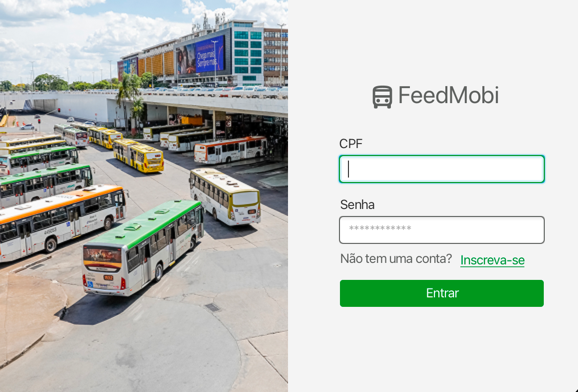

# FeedMobi

> Sistema de Gestão da Qualidade do Transporte Público Multimodal do DF

## Objetivo
Projeto para gerenciar reclamações da população, monitorar frota, controlar infraestrutura urbana (paradas, estações, ciclovias) e avaliar satisfação dos usuários entre diferentes modais no Distrito Federal.



## Requisitos
- Java 17+ (ou versão usada no projeto)
- MariaDB (10.3+ recomendado)
- Build tool: Gradle ou Maven (conforme o projeto)
- IDE: IntelliJ IDEA / VS Code (com suporte a JavaFX)

## Stack
* MariaDB - Banco de Dados
* JDBC - Backend
* JavaFX - Frontend

## Perfis de Acesso
* Usuário avaliador
  * Consultar avaliações
  * Incluir nova avaliação
* Gestor
  * Dashboard
  * Gestão de Infraestrutura, Veículos, Funcionários, Percursos e Viagens

## Regras de Negócio

* Se deletar um usuário, são excluídas todas as avaliações feitas pelo usuário (ON CASCADE).
* Não é permitido excluir um motorista, veículo e/ou infraestrutura (parada, ciclovia) caso estejam vinculados a avaliações (manutenção do histórico).
Caso não estejam vinculados a nenhuma avaliação, permite a exclusão.


## Operações com banco de dados

### View

> Consolida um relatório geral das avaliações (Viagem, Parada, Ciclovia). 

```sql

CREATE OR REPLACE VIEW Relatorio_Geral_Avaliacoes AS
       SELECT
           A.codigo,
           A.texto,
           A.nota,
           A.usuario,
           'Viagem' AS tipo_avaliacao,
           V.viagem AS codigo_id
       FROM Avaliacao A
       JOIN Viagem_Reclamacao V ON A.codigo = V.reclamacao

        UNION ALL

        SELECT
            A.codigo,
            A.texto,
            A.nota,
            A.usuario,
            'Parada' AS tipo_avaliacao,
            P.parada AS codigo_id
       FROM Avaliacao A
       JOIN Parada_Reclamacao p on A.codigo = P.reclamacao

       UNION ALL

        SELECT
           A.codigo,
           A.texto,
           A.nota,
           A.usuario,
           'Ciclovia' AS tipo_avaliacao,
           C.ciclovia AS codigo_id
        FROM Avaliacao A
        JOIN Ciclovia_Reclamacao C on A.codigo = C.reclamacao;

```


### Trigger

### Procedure